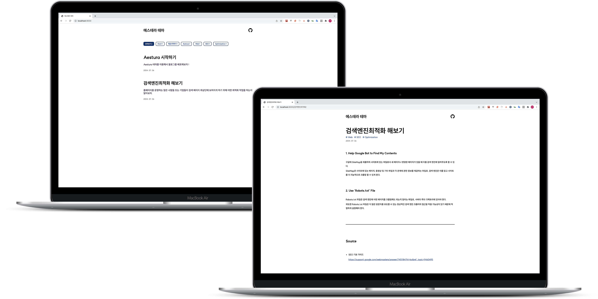

<!-- AUTO-GENERATED-CONTENT:START (STARTER) -->
<p align="center">
    
</p>
<h1 align="center">
  Gatsby-Starter-Aestura
</h1>

**Gatsby-Starter-Aestura** 는 Gatsby로 구동되는 심플한 UI 를 지닌 Blog template 입니다.



## 기능

- Comment feature (utterances)
- github, linkedIn, twitter 링크 연결
- sitemap.xml, robots.txt 자동 생성
- 전용 코드 하이라이팅 테마
- 무한 스크롤
- 카테고리 필터링

> Gatsby-Starter-Aestura는 [SUIT](http://sunn.us/suit/) font를 사용했습니다.

---

## 시작

### 실행

```sh
# Install dependencies
$ yarn

# Start development server
$ yarn develop
```

### 블로그 정보 설정

```js
# /gatsby-meta-config.js

{
  siteTitle: '', // Aesture 블로그의 title로 사용됩니다.
  description: '', // 블로그에 대한 설명을 작성해주세요.
  author: '', // 이름을 작성해주세요.
  siteUrl: '', // 사이트의 URL을 작성해주세요.
  siteRepo: '', // uttrances를 위한 속성입니다.
  githubId: '', // github ID를 작성해주세요.
  linkedInId: '', // linkedIn 프로필 URL의 맨마지막 path 값을 작성해주세요.
  twitterId: '', // 트위터 ID를 작성해주세요.
},
```

### 블로그 글 쓰기

블로그에 글을 쓰려면 `/content` 아래에 마크다운 파일을 생성하시면 됩니다. 마크다운 파일의 이름은 URL path에 사용됩니다.

#### meta 정보

markdown 파일의 상단에는 아래와 같은 요소들이 작성되어야 합니다.

```
---
date: '2004-07-06' // 아티클을 작성한 날짜 YYYY-MM-DD 형식을 지켜주세요
title: '검색엔진최적화' // 아티클의 제목을 작성해주세요
categories: ['Web', 'SEO', 'Optimization'] // 카테고리를 작성해주세요
summary: '검색 엔진 최적화 작업을 어떻게 하는지 알아보자.' // 메인 페이지에서 보일 아티클의 요약글입니다.
---
```

### 댓글 기능 (uttrances)

utterances는 github의 issue 기능을 통한 댓글 기능을 제공하는 어플리케이션입니다.

github에 가입되어있기만 하면 사용할 수 있어 사용 방법이 매우 간편하고, 용량도 가벼워 여러 정적 사이트에서 많이 사용됩니다.

#### 사전 설정

utterances를 사용하기 위해서는 Github에 utterances 어플리케이션을 추가해줘야 합니다.

[uttrances 어플리케이션 링크](https://github.com/apps/utterances)에 접속하여 `install` 버튼을 통해 설치해주세요.

그렇게 되면 권한을 설정할 레포지터리를 지정할 수 있는 페이지가 나오게 되는데 모든 레포지토리에 권한을 부여해도 되지만, 해당 블로그 레포지터리에만 권한을 부여하는게 좋습니다.

그리고 앞서 설명했던 `gatsby-meta-config.js` 의 `siteRepo` 부분에 `userName/repoName` 형식으로 작성해주시면 됩니다. 그리고 댓글을 달아 이슈가 잘 생성되는지 확인해보세요.

### 배포

#### github pages

`Repository` 이름을 [username].github.io 의 형태로 맞춰주세요

github pages에서는 기본 설정으로 default 브랜치의 파일을 호스팅해주므로 따로 개발용 브랜치를 생성하여 개발을 진행하는 것을 권장드립니다.

github pages로 배포하고 싶다면 `gh-pages` 라이브러리를 설치해야 합니다. 아래 커맨드를 작성하여 실행해주세요.

```sh
$ yarn add gh-pages -D
```

아래 배포 스크립트를 `package.json` 파일에 추가해주세요.

```json
"deploy": "gatsby build && gh-pages -d public -b master"
```

```json
{
  ...,
  "scripts": {
    "build": "gatsby build",
    "develop": "gatsby develop",
    "format": "prettier --write \"**/*.{js,jsx,ts,tsx,json,md}\"",
    "start": "gatsby develop",
    "serve": "gatsby serve",
    "clean": "gatsby clean",
    "test": "echo \"Write tests! -> https://gatsby.dev/unit-testing\" && exit 1",
    "deploy": "gatsby build && gh-pages -d public -b master"
  },
  ...
}
```

github pages로 배포했다면 기본 URL은 `https://[username].github.io/` 으로 설정되므로 `gatsby-config.js` 파일의 `siteUrl` 속성값을 변경해주세요.

또한, `gatsby-plugin-canonical-urls` 옵션 부분도 똑같이 변경해주세요.

```js
module.exports = {
  siteMetadata: {
    ...,
    siteUrl: 'https://[username].github.io/',
  },
  plugins: [
		...,
    {
      resolve: 'gatsby-plugin-canonical-urls',
      options: {
        siteUrl: 'https://[username].github.io/',
        stripQueryString: true,
      },
    },
		...
  ],
};
```

마지막으로 다음 커맨드를 통하여 배포해주세요.

```sh
$ yarn deploy
```

`Published` 가 뜬다면 배포가 성공적으로 이루어진겁니다.

블로그를 배포한 `Repository` 의 Setting 탭으로 들어가주세요.

아래로 스크롤을 내리면 github pages 설정 구간이 나오게 될 텐데, 아래 사직과 같이 웹 사이트가 배포 되었다는 표시가 뜨는지 확인하세요.

배포가 완전히 되는데 시간이 좀 걸릴수 있습니다.

이제 `https://[username].github.io` 에 들어가서 블로그를 확인하실 수 있습니다.
